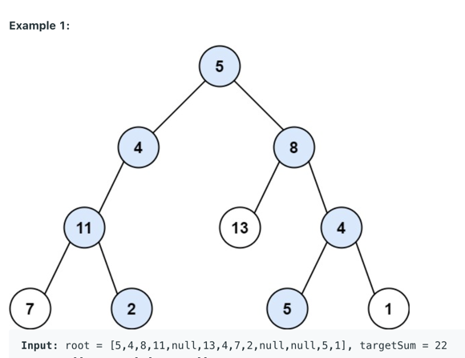

# Data Structure & Algorithm

## Coding

### Easy

#### [Combination Sum](https://leetcode.com/problems/combination-sum/)

Given an array of distinct integers candidates and a target integer `target`, return a list of all unique combinations
of candidates where the chosen numbers sum to target.

The same number may be chosen from candidates an unlimited number of times. Two combinations are unique if the frequency
of at least one of the chosen numbers is different.

```
Input: candidates = [2,3,6,7], target = 7
Output: [[2,2,3],[7]]
Explanation:
2 and 3 are candidates, and 2 + 2 + 3 = 7. Note that 2 can be used multiple times.
7 is a candidate, and 7 = 7.
These are the only two combinations.
```

```
Input: candidates = [2,3,5], target = 8
Output: [[2,2,2,2],[2,3,3],[3,5]]
```

```
Input: candidates = [2], target = 1
Output: []
```

Solution [link](https://github.com/ShivKJ/practice/blob/master/leetcode/problem39.py).

#### [Maximum Subarray](https://leetcode.com/problems/maximum-subarray/)

Given an integer array `nums`, find the contiguous subarray (containing at least one number) which has the largest sum
and return its sum.

A subarray is a contiguous part of an array.

```
Input: nums = [-2,1,-3,4,-1,2,1,-5,4]
Output: 6
Explanation: [4,-1,2,1] has the largest sum = 6.
```

Solution [link](https://github.com/ShivKJ/practice/blob/master/leetcode/problem53.py).

#### [Merge Intervals](https://leetcode.com/problems/merge-intervals/)

Given an array of `intervals`, merge all overlapping intervals, and return an array of the non-overlapping intervals
that cover all the intervals in the input.

Each item in array `intervals` is list of numbers size 2 where first number represents start and second number
represents end of interval.

```
Input: intervals = [[1,3],[2,6],[8,10],[15,18]]
Output: [[1,6],[8,10],[15,18]]
Explanation: Since intervals [1,3] and [2,6] overlap, merge them into [1,6].
```

```
Input: intervals = [[1,4],[4,5]]
Output: [[1,5]]
Explanation: Intervals [1,4] and [4,5] are considered overlapping.
```

**Note:** array `intervals` will have length at least 1.

Solution [link](https://github.com/ShivKJ/practice/blob/master/leetcode/problem56.py).

### Medium

#### Minimise Cost

There are `n` tasks and cost to complete `ith` task is `costs[i]` where `costs` is array of numbers of size `n`
and `0 <= i < n`.

If first tasks is picked then all the other tasks have to be completed, otherwise at least one of the tasks should be
left. Return an array `x` of numbers, containing `0` or `1` of size `n` where `x[i] = 1` means `ith` task is picked,
such that total cost incurred for picked tasks is minimum.

```python
from typing import List


def min_cost(costs: List[float]) -> List[int]:
    """
    let n = len(costs) and x[i] is binary variable 0 <= i < n

    minimise: sum(costs[i] * x[i] for i in range(n))

    constraint: x[0] = x[1] * x[2] * ... * x[n-1]

    :param costs:
    :return:
    """
    n = len(costs)

    if n < 2:
        raise ValueError(f'number of elements in array can '
                         f'not be less than 2, given array size={n}')

    x = [0] * n
    rest_costs = costs[1:]

    # we branch on the variable x[0]. It can take two values
    # if x = 1
    #   it means x[1], ..., x[n - 1] must all be 1. So objective function
    #   value for this configuration, obj1 = sum(costs)
    obj1 = sum(costs)

    # otherwise (i.e. x = 0),
    #   we need to set value of at least one of the variables to 0 apart from x[0].
    #   But which one to choose?

    #   Defining rest_costs = costs[1:]
    #
    #   As we want to minimise the objective function, so we will want to keep as
    #   many negative numbers, from rest_costs, as possible.
    #
    #   Ofcourse, we can not keep all the numbers from costs, because it will make
    #   solution infeasible. So in case when all the numbers in rest_costs are negative,
    #   then finding the largest cost and setting value for its corresponding variable to 0
    obj2 = sum(c for c in rest_costs if c < 0)
    max_cost_idx_in_rest_costs = None

    if all_negative := all(e < 0 for e in rest_costs):
        max_cost_idx_in_rest_costs = rest_costs.index(max(rest_costs))
        obj2 -= rest_costs[max_cost_idx_in_rest_costs]  # so, x[1 + max_cost_idx_in_rest_costs] = 0
    # ------------------------------------------------------------------------------

    # constructing output
    if obj1 <= obj2:
        # case for x[0] = 1 and hence x[1],...x[n-1] all should be 1
        for i in range(n):
            x[i] = 1
    else:
        # case for x[0] = 0

        for i, c in enumerate(costs):
            x[i] = int(c < 0)

        x[0] = 0

        if all_negative:
            # in the above loop, we will have set x[1:] to 1, which will break
            # feasibility of solution, so setting x[1 + max_cost_idx_in_rest_costs] = 0.
            # (max_cost_idx_in_rest_costs is defined and not None)
            # Note that: we are adding 1 to max_cost_idx_in_rest_costs
            # as max_cost_idx_in_rest_costs is defined in rest_costs array.
            x[1 + max_cost_idx_in_rest_costs] = 0

    return x
```

### Medium

#### [Longest Increasing Subsequence](https://leetcode.com/problems/longest-increasing-subsequence/)

Given an integer array `nums`, return the length of the longest strictly increasing subsequence.

```
Input: nums = [10,9,2,5,3,7,101,18]
Output: 4
Explanation: The longest increasing subsequence is [2,3,7,101], therefore the length is 4.
```

Solution [link](https://github.com/ShivKJ/practice/blob/master/leetcode/problem300.py)

#### [Max points on a line](https://leetcode.com/problems/max-points-on-a-line/)

Given an array of points where `points[i] = [xi, yi]` represents a point on the X-Y plane, return the maximum number of
points that lie on the same straight line.

Solution [link](https://github.com/ShivKJ/practice/blob/master/leetcode/problem149.py)

```python
from collections import Counter
from math import gcd
from typing import List, Tuple


def dx_dy_of_slope(x1, y1, x2, y2) -> Tuple[int, int]:
    """
    let dx = x2 - x1 and dy = y2 - y1 (given that both dx and dy can not be zero)

    if dx ! =0 :
        slope = dy / dx
              = -dy / -dx
              = (dy / gcd(dx, dy)) / (dx / gcd(dx, dy))

    As a convention, if dx = 0 then |dy| -> dy

    :param x1:
    :param y1:
    :param x2:
    :param y2:
    :return:
    """
    dx, dy = x2 - x1, y2 - y1

    d = gcd(dx, dy)  # d > 0
    dx, dy = dx // d, dy // d

    if dx < 0 or (dx == 0 and dy < 0):
        dx, dy = -dx, -dy

    return dx, dy


class Solution:
    def maxPoints(self, points: List[List[int]]) -> int:
        if (n := len(points)) < 3:
            return n

        output = 0

        for i, (x1, y1) in enumerate(points):
            if n - i < output:  # n - i + 1 <= output, so even if all the
                # points i, i + 1, .. n - 1 lie on the line, it will be less than output.
                # Note that: this "if" condition is not required theoretically
                break

            same_slope_cnt = Counter()  # lines passing through (x1, y1) with different slopes are counted
            max_points_on_same_slope = 0

            for j in range(i + 1, n):
                x2, y2 = points[j]
                dx_dy = dx_dy_of_slope(x1, y1, x2, y2)

                same_slope_cnt[dx_dy] += 1
                max_points_on_same_slope = max(max_points_on_same_slope, same_slope_cnt[dx_dy])

            max_points_on_same_slope += 1  # +1 for considering ith point

            output = max(output, max_points_on_same_slope)

        return output
```

#### [Paths from root to leaf](https://leetcode.com/problems/path-sum-ii/)

Given the `root` of a binary tree and an integer `target_sum`, return all root-to-leaf paths where the sum of the node
values in the path equals target_sum.

Each path should be returned as a list of the node values, not node references. A root-to-leaf path is a path starting
from the root and ending at any leaf node. A leaf is a node with no children.



```python
from collections import deque
from typing import List, Optional


class TreeNode:
    def __init__(self, x: int):
        self.val = x
        self.left: Optional['TreeNode'] = None
        self.right: Optional['TreeNode'] = None


def is_leaf(rt: TreeNode) -> bool:
    return rt.left is None and rt.right is None


class Solution:
    def pathSum(self, root: Optional[TreeNode], target: int) -> List[List[int]]:
        output, path = [], deque()

        def dfs(rt: Optional[TreeNode], path_sum: int):
            if rt is not None:
                path.append(rt.val)

                # ----------------------------------------------
                path_sum += rt.val

                if is_leaf(rt):
                    if path_sum == target:
                        output.append(list(path))
                else:
                    dfs(rt.left, path_sum)
                    dfs(rt.right, path_sum)
                # ----------------------------------------------

                path.pop()

        dfs(root, 0)

        return output
```

#### [Satisfiability of Equality Equations](https://leetcode.com/problems/satisfiability-of-equality-equations/)

You are given an array of strings equations that represent relationships between variables where each string
equations[i] is of length 4 and takes one of two different forms: `"xi==yi"` or `"xi!=yi"`. Here, xi and yi are
lowercase letters (not necessarily different) that represent one-letter variable names.

Return true if it is possible to assign integers to variable names so as to satisfy all the given equations, or false
otherwise.

**Example 1**

```
Input: equations = ["a==b","b!=a"]
Output: false
Explanation: If we assign say, a = 1 and b = 1, then the first equation is satisfied, but not the second.
There is no way to assign the variables to satisfy both equations.
```

**Example 2**

```
Input: equations = ["b==a","a==b"]
Output: true
Explanation: We could assign a = 1 and b = 1 to satisfy both equations.
```

Solution [link](https://github.com/ShivKJ/practice/blob/master/leetcode/problem990.py)
